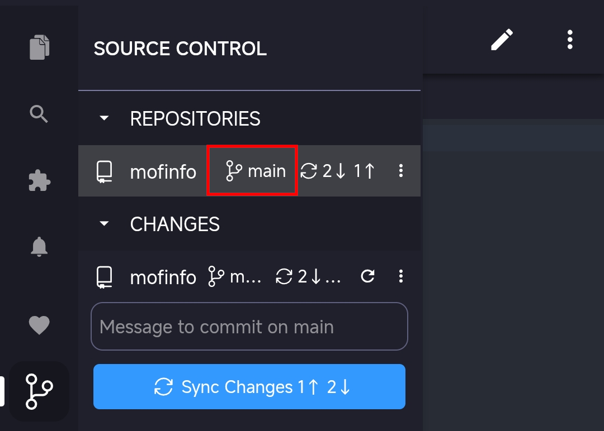

# Git Branches and Worktrees in Acode

Git branches enable you to work on different features or experiments simultaneously without affecting your main codebase. Acode Git SCM provides tools for branch management, Git worktrees for parallel development, and stash management for temporary changes.

This article covers working with branches, worktrees, and stashes in Acode to manage parallel development work.

## Working with branches

Branches are lightweight, movable pointers to specific commits in your Git history. They allow you to diverge from the main line of development and work on features independently.

For example, suppose you're working on a web application and need to add user authentication while also fixing a bug in the payment system. You can create two branches:

- `feature/user-authentication` - contains your login and signup functionality
- `bugfix/payment-validation` - contains fixes for payment processing errors

Each branch maintains its own set of changes without affecting the other. You can switch between branches to work on different tasks, and later merge the completed branches back into your main branch.

### View current branch

The current branch appears in several places in Acode:

- **Status Bar**: shows the current branch name and allows quick branch switching
- **Repositories view**: displays the current branch in the repository header

### Switch between branches

Switching to a different branch is called "checking out" a branch in Git terminology. When you check out a branch, Git updates your working directory to match that branch's state.

To switch to a different branch:

1. Select the branch name in the Status Bar, or run the **Git: Checkout to** command from the Command Palette

2. Choose from the list of available branches:
   - **Local branches**: Branches that exist on your local machine
   - **Remote branches**: Branches from the remote repository that you can check out locally

> [!TIP]
> If you have uncommitted changes when switching branches, Git might prevent the switch to avoid losing work. Consider committing your changes or using a [stash](#stash-management) before switching.

### Create new branches

Create a new branch to start working on a feature or experiment:

1. Select the branch name in the Status Bar or run **Git: Create Branch** from the Command Palette.

1. Enter a name for your new branch. Use descriptive names like `feature/user-authentication` or `bugfix/login-error`.

1. Choose the source branch (usually `main` or `develop`) from which to create the new branch.

Acode Git SCM switches to the new branch after creation.

### Rename and delete branches

To rename the current branch:

1. Run **Git: Rename Branch** from the Command Palette or select it from the **More Actions** (⋮) menu.
1. Enter the new branch name.

To delete a branch:

1. Switch to a different branch (you can't delete the currently active branch).
1. Run **Git: Delete Branch** from the Command Palette or select it from the **More Actions** (⋮) menu.
1. Select the branch to delete from the list.

You can also delete a remote branch by using the matching **Delete Remote Branch** action.

> [!CAUTION]
> Deleting a branch permanently removes it from your local repository. Make sure the branch has been merged or you no longer need the changes.

### Merge and publish branches

When your feature is complete, merge it back into the main branch:

1. Switch to the target branch (usually `main` or `develop`).
1. Run **Git: Merge Branch** from the Command Palette.
1. Select the branch to merge.

To publish a branch to your remote repository, use the **Publish Branch** action.

## Working with Git worktrees

Acode Git SCM has built-in support for [Git worktrees](https://git-scm.com/docs/git-worktree), making it easy to manage and work with multiple branches at the same time.

### Understanding worktrees

A worktree is a separate checkout of a Git branch in its own directory. This allows you to have multiple working directories for the same repository, each on a different branch. Worktree functionality is especially useful for:

- Work on multiple features simultaneously in separate folders
- Run different versions of your application side by side
- Compare implementations across branches

### Create a worktree

To create a new worktree in Acode:

1. Open the **Source Control Repositories** view from the Source Control view.
1. Select your repository, open the **More Actions (⋮)** menu, and choose **Worktrees** > **Create Worktree**.
1. Follow the prompts to choose a branch and location for the new worktree.

   Acode Git SCM creates a new folder for the worktree at the specified location and checks out the selected branch into that folder.

The new worktree appears as a separate entry in the **Source Control Repositories** view.

### Switch between worktrees

Acode Git SCM can display multiple repositories (including worktrees) simultaneously:

- Each worktree appears as a separate repository in the **Source Control Repositories** view
- Use **Open Recent** to quickly switch between worktree directories

### Automatically detect worktrees

By default, Acode Git SCM lists the worktrees that you create from the **Source Control Repositories** view. To also automatically detect worktrees that already exist in your repository, enable the setting (`Git: Detect Worktrees`) setting. When this setting is enabled, Acode Git SCM scans the repository for worktrees and shows them in the **Source Control Repositories** view.

To avoid scanning a large number of worktrees, Acode Git SCM limits the number of detected worktrees. Use the setting (`Git: Detect Worktrees Limit`) setting to change this limit. The default value is 20.

## Next steps

- [Staging and Committing](/docs/staging-commits.md) - Learn about committing changes within branches
- [Repositories and Remotes](/docs/repos-remotes.md) - Work with remote branches and collaboration
