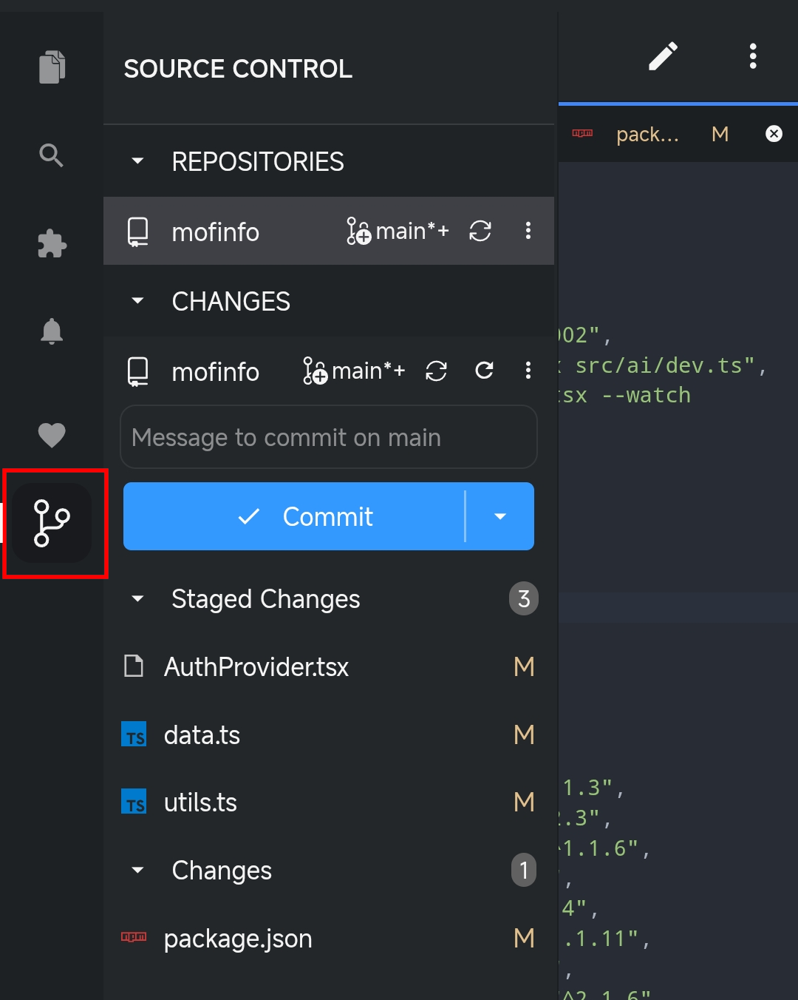
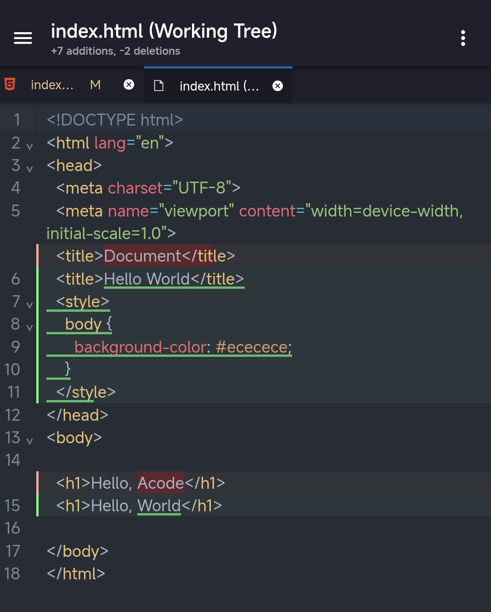
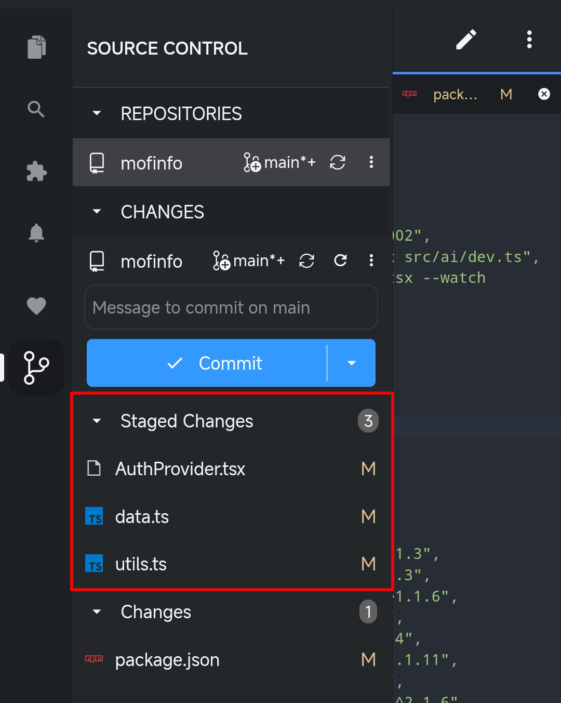
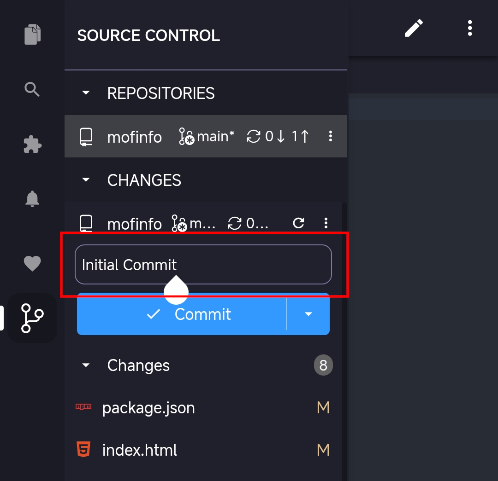
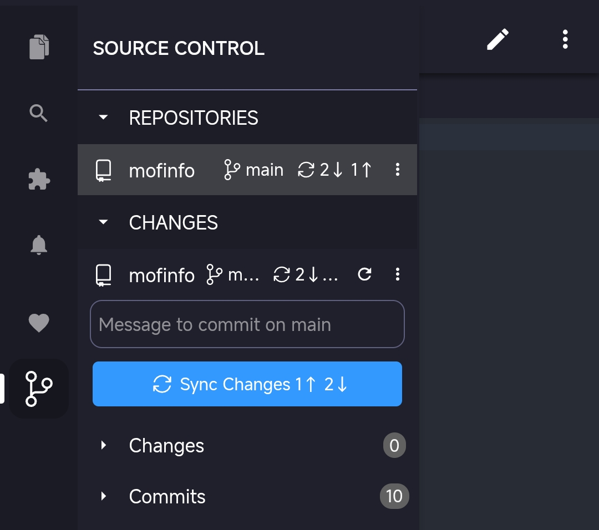
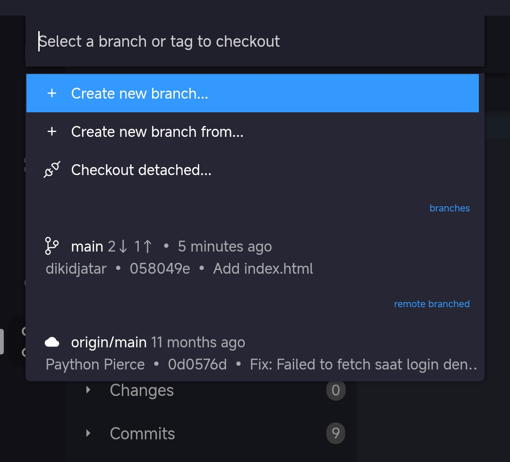
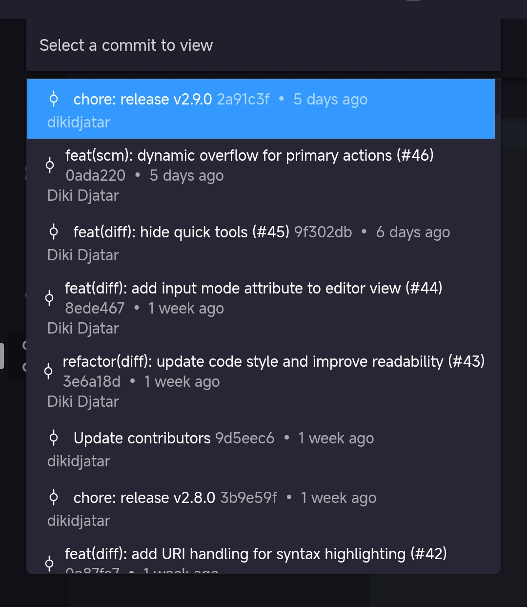
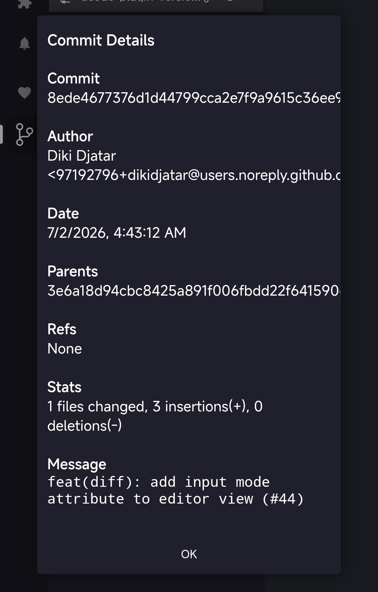

# Source Control in Acode

Acode Editor has source control management (SCM) that lets you work with Git and other version control systems directly in your editor. You can install plugin for Git SCM from the [Acode Marketplace](https://acode.app/plugin/acode.plugin.version.control.gitpro).

The source control interface provides access to Git functionality through a graphical interface instead of terminal commands. You can perform Git operations like staging changes, committing files, creating branches, and merge without switching to the command line.

Changes you make in the Acode interface are synced with your command-line Git operations, so you can use both the UI and terminal as needed. The source control interface works alongside the command line rather than replacing it.

To use Git features in Acode, you need:

- Acode uses your machine's Git installation. [Install Git version 2.0.0 or later](https://git-scm.com/download) on your machine.

- When you commit changes, Git uses your configured username and email. You can set these values with:

  ```bash
  git config --global user.name "Your Name"
  git config --global user.email "your.email@example.com"
  ```

> [!TIP]
> If you're new to Git, the [git-scm](https://git-scm.com/doc) website is a good place to start, with a popular online [book](https://git-scm.com/book), Getting Started [videos](https://git-scm.com/video/what-is-git) and [cheat sheets](https://github.github.com/training-kit/downloads/github-git-cheat-sheet.pdf).

## Get started with a repository

Acode automatically detects when you open a folder that's a Git repository and activates all source control features. To get started with a new or existing repository, you have several options:

- **Initialize a new repository**: Create a new Git repository for your current folder.

- **Clone a repository**: Clone an existing repository from GitHub or another Git host.

> [!TIP]
> You can publish a local repository directly to GitHub with the **Publish to GitHub** command using the Acode GitHub Plugin at [https://acode.app/plugin/dikidjatar.plugin.github](https://acode.app/plugin/dikidjatar.plugin.github), which will create a new repository and push your deployment in one step.

Learn more about [cloning and publishing repositories](/docs/repos-remotes.md#clone-repositories).

## Source control interface

Acode plugin Git SCM provides Git functionality through several key interface elements. This UI integration enables you to perform Git operations without knowing terminal commands:

- **Source Control view**: central hub for common Git operations like staging, committing, and managing changes

  

- **Diff editor**: unified diff file comparisons for effective change review

  

## Common workflows

### Stage and commit changes

Review your changes in the Source Control view, then stage files by clicking and holding a file and selecting the Stage Changes menu, or click and hold a group to select Stage All Changes.



Type your commit message in the input box



Learn more about [staging changes and writing commits](/docs/staging-commits.md).

### Sync with remotes

When your branch is connected to a remote branch, Acode Git SCM shows sync status in the Status Bar and shows incoming and outgoing commits in the Source Control view. You can quickly sync or perform individual fetch, pull, and push operations.



Learn more about [working with repositories and remotes](/docs/repos-remotes.md).

### Work with branches, worktrees, and stashes

Acode Git SCM supports multiple workflows for managing parallel development work.

- Quickly switch between **branches** within a single workspace to work on different features or fixes.

  

- Use Git **worktrees** to create separate working directories for different branches to work with multiple branches simultaneously.

- Use Git **stashes** to temporarily save uncommitted changes when you need to switch contexts quickly.

Learn more about [working with branches and worktrees](/docs/branches-worktrees.md).

### View commit history

It can be helpful to review the commit history to understand how your code has changed over time.

- The **Commit History** provides a visual representation of your commit history.

  

- Commit Details

  

## Next steps

- [Source Control Quickstart](/docs/quickstart.md) - Quickly get started with Git source control in Acode
- [Branches and Worktrees](/docs/branches-worktrees.md) - Learn about branch management, Git worktrees, and stash operations
- [Repositories and Remotes](/docs/repos-remotes.md) - Learn about cloning, publishing, and syncing with remote repositories
