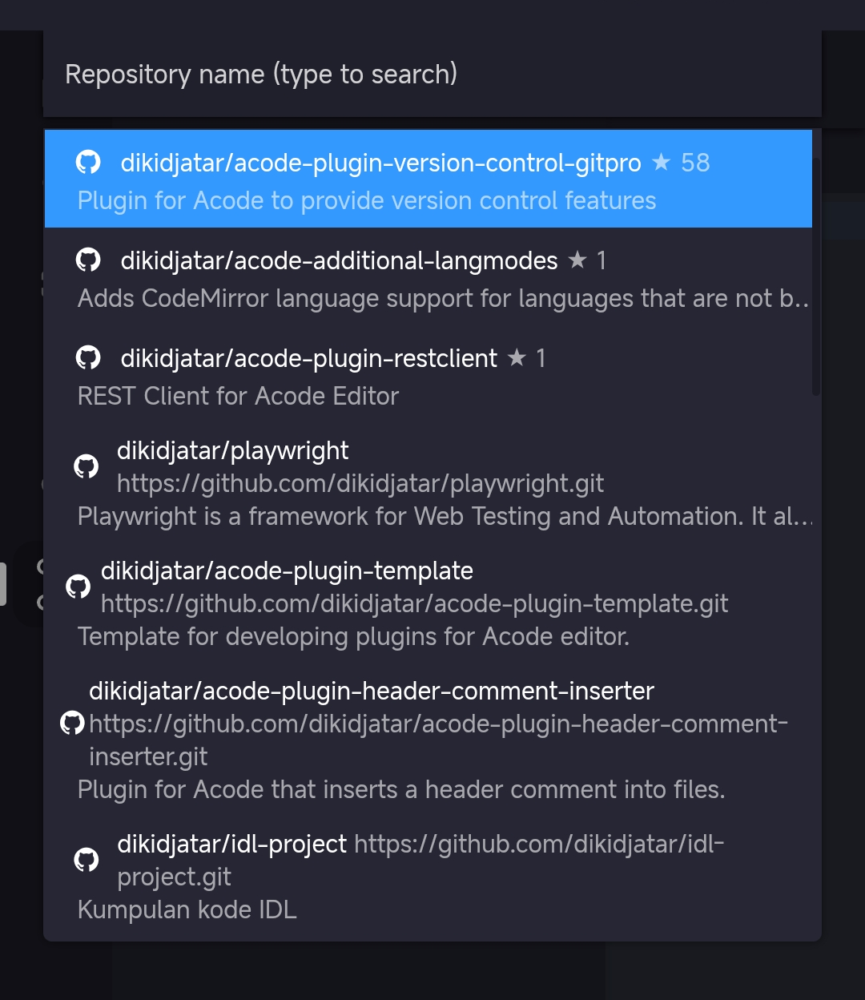
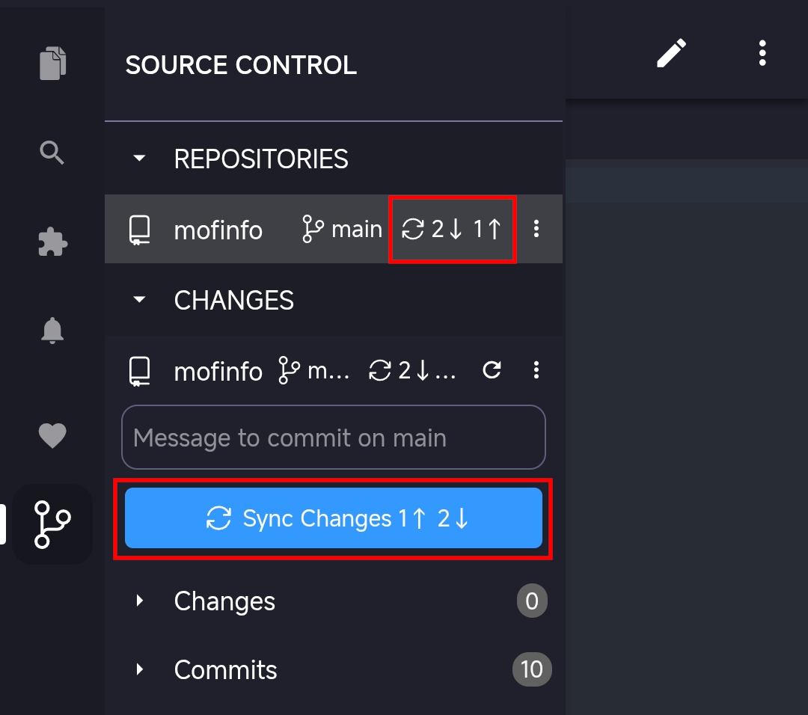
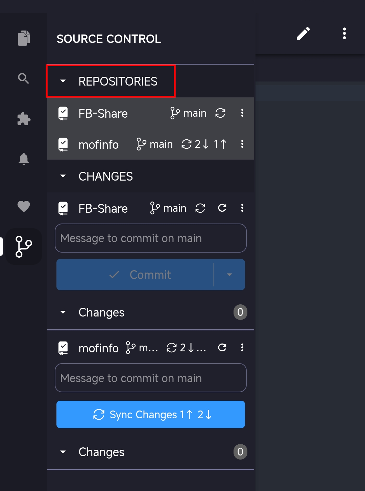

# Working with repositories and remotes

Git repositories and remotes enable you to collaborate with others by syncing your work across different locations. Acode Git SCM provides tools for working with remote repositories without needing command-line Git knowledge.

This article covers working with Git repositories and remotes, including cloning, publishing, syncing changes, and managing multiple repositories in Acode Git SCM.

## Understanding remotes

A remote is a Git repository hosted on another server, such as GitHub, Azure DevOps, or GitLab. Remotes enable collaboration by providing a central location where team members can share their work.

When you clone a repository, Git automatically creates a remote named `origin` that points to the original repository. You can work with multiple remotes if you need to interact with different servers or repositories.

Working with remotes involves three main operations:

- **Fetch**: downloads commits from the remote without changing your working files. This lets you see what others have done without merging their changes into your work.

- **Pull**: downloads commits from the remote and merges them into your current branch. This is fetch plus merge in one operation.

- **Push**: uploads your local commits to the remote so others can access your changes.

When you push, Git needs to know which remote to send your commits to. By default, Git uses the upstream branch configured for your current branch. If no upstream is set, Acode Git SCM prompts you to publish the branch and set the upstream.

## Add a remote

To add a new remote to your repository:

1. In the Source Control view, select **More Actions** (**⋮**) > **Remotes** > **Add Remote**

   Alternatively, run the **Git: Add Remote** command from the Command Palette.

1. Enter the remote URL

1. Enter a name for the remote (for example, `upstream`)

Your repository now has an additional remote that you can fetch from or push to.

Use similar steps to remove a remote (**Git: Remove Remote**).

## Clone repositories

Cloning creates a local copy of a remote repository on your machine. The cloned repository includes all branches, commits, and history from the remote. By default, Git configures a remote named `origin` pointing to the URL you cloned from.

To clone a repository, run the **Git: Clone** command in the Command Palette, or select the **Clone Repository** button in the Source Control view.

If you clone from GitHub, Acode Git SCM prompts you to authenticate with GitHub. Then, select a repository from the list to clone to your machine. The list contains both public and private repositories. For other Git providers, enter the repository URL.

When cloning, Acode Git SCM asks you to select a local folder to store the repository. After cloning, you can choose to open the cloned repository.

## Publish to GitHub

If you have a local repository that isn't connected to a remote, you can publish it directly to GitHub from Acode.

To publish a repository to GitHub:

1. Open the Source Control view

1. Select **Publish to GitHub** in the Source Control view

1. Sign in to GitHub if prompted

1. Choose whether to create a public or private repository

1. Select which files to include in the initial commit

Acode Git SCM creates a new repository on GitHub, adds it as a remote, and pushes your commits.

> [!TIP]
> Publishing to GitHub is the fastest way to get your local work online. It creates the repository, configures the remote, and pushes your commits in one step.

## Push, pull, and sync

Pushing, pulling, and syncing are the core operations for keeping your local work in sync with remote repositories.

### Push commits

Pushing uploads your local commits to the remote repository. To push commits:

1. Commit your changes locally

1. Select **More Actions** (**⋮**) > **Push** in the Source Control view

   Alternatively, select the sync icon in the Status Bar to both pull and push in one operation. If you want to push to a specific remote, use the **Push to** option.

1. If prompted, sign in to authenticate with the remote

Your commits are uploaded to the remote branch. Other team members can now pull your changes.

> [!NOTE]
> If your branch doesn't have an upstream configured, Git SCM prompts you to publish the branch first.

### Pull commits

Pulling downloads commits from the remote repository and merges them into your local branch. To pull commits:

1. Select **More Actions** (**⋮**) > **Pull** in the Source Control view

   Alternatively, select the sync icon in the Status Bar to both pull and push in one operation. If you want to pull from a specific remote, use the **Pull from** option.

1. Acode Git SCM downloads and merges the remote commits

### Pull with rebase

Instead of merging remote changes, you can rebase your local commits on top of the remote changes:

1. Select **More Actions** (**⋮**) > **Pull (Rebase)** in the Source Control view

1. Acode Git SCM applies the remote commits first, then replays your local commits on top

Rebasing creates a linear history without merge commits. Learn more about [Git rebase](https://git-scm.com/docs/git-rebase).

### Sync changes

Syncing combines pull and push operations - it first pulls changes from the remote, then pushes your local commits. This is the recommended way to keep your work synchronized.

To sync changes:

- Select **Sync Changes** in the Source Control view
- Select the sync icon in the Status Bar

The Status Bar sync indicator shows how many commits you have to push (↑) and pull (↓). For example, `↑2 ↓1` means you have 2 commits to push and 1 commit to pull.

> [!TIP]
> Configure the setting (`Git: Confirm Sync`) setting to control whether Acode asks for confirmation before syncing.

### Fetch commits

Fetching downloads commits from the remote repository without merging them into your local branch. This lets you review incoming changes before integrating them.

To fetch commits:

- Select **More Actions** (**⋮**) > **Fetch** in the Source Control view
- Select **Fetch From All Remotes** to fetch from all configured remotes
- Select **Fetch (Prune)** to fetch and remove deleted remote branches (to always prune, enable the setting (`Git: Prune On Fetch`) setting)

To automatically fetch commits in the background, enable the setting (`Git: Auto Fetch`) setting (disabled by default). To configure the fetch interval, use the setting (`Git: Autofetch Period`) setting (default 180 seconds).

## Status Bar sync actions

The Status Bar provides quick access to common repository and remote operations without opening the Source Control view.

### Branch indicator

The branch indicator in the lower-left corner shows:

- **Current branch name**: select to switch branches
- **Sync status**: number of commits to push (↑) and pull (↓)
- **Publishing state**: shows **Publish Branch** for unpublished branches

The sync icon (rotating arrows) in the Status Bar enables you to sync your changes with the remote (push and pull).

You can customize Status Bar behavior with these settings:

- setting (`Git: Show Action Button`): control which action button to show (sync or commit)
- setting (`Git: Show Commit Input`): show commit input in the Source Control view

## Working with repositories

The Repositories view enables you to manage multiple Git repositories in a single workspace. This is useful when working with projects that span multiple repositories. The Repositories view also shows [Git worktrees](/docs/branches-worktrees.md) associated with your repositories.

For each repository, you can see the active branch, sync status, and access actions like fetch, pull, push, and more.

Acode Git SCM automatically detects Git repositories when you open folders that contain them. If you open a folder with multiple repositories (like a monorepo), all repositories appear in the Repositories view.

### Repository selection modes

If you prefer to focus on a single repository or worktree at a time, you can switch to single repository mode. In that mode, you only see the changes for the selected repository. When operating in multi-repo mode, the Source Control view shows changes across all repositories. Use the setting (`SCM Repositories Selection Mode`) setting to switch between multi-repo and single-repo modes.

## Next steps

- [Branches and Worktrees](/docs/branches-worktrees.md) - Learn about branch management and parallel development
- [Staging and Committing](/docs/staging-commits.md) - Master the commit workflow