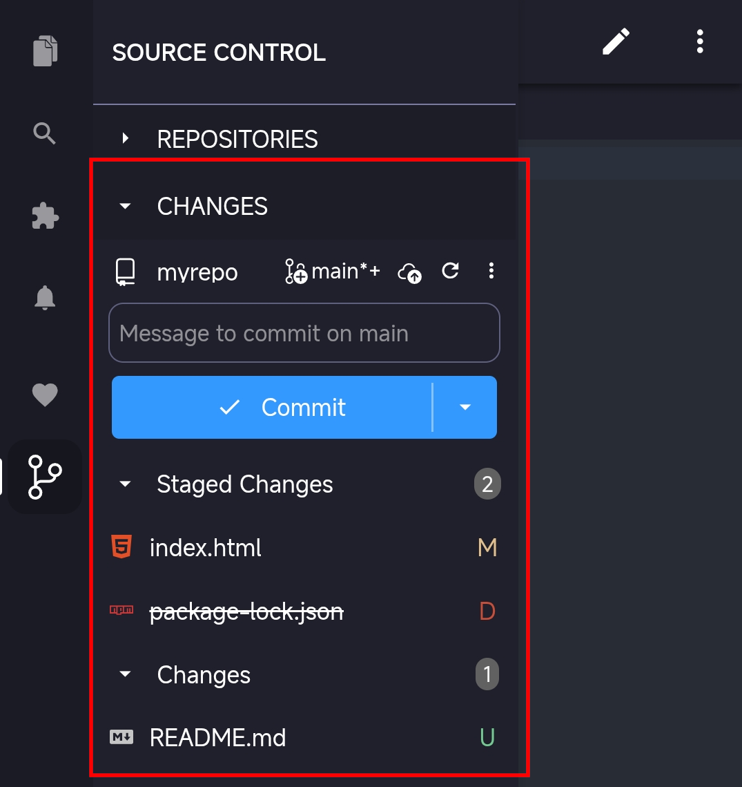

# Staging and committing changes

Creating focused commits with clear descriptions helps you and your team understand the history of your codebase. Acode Git SCM provides integrated Git tools for staging changes and creating commits, with support for granular control over which changes to include.

This article covers the staging and commit workflow in Acode.

## Git workflow

Git uses a two-step process to save your work: staging and committing. When you modify files, Git tracks these changes but doesn't automatically include them in your next commit. Staging lets you select which changes to include in each commit.

Think of staging as preparing a snapshot of your work. You can stage all changes at once for a comprehensive commit, or stage specific files and even individual lines to create focused, logical commits that are easier to review and understand later.

## View change

The Source Control view is your central hub for managing changes in your Git repository. Changes are organized into two sections based on their staging status:

- **Changes**: lists all modified, added, or deleted files that are not yet staged for commit
- **Staged Changes**: lists files that have been staged and are ready to be committed

Notice that changed files are listed with a "U" (untracked), "M" (modified), or "D" (deleted) icon next to them to indicate the type of change. This change indicator is also shown in the Explorer view and in the editor tab title for modified files.
